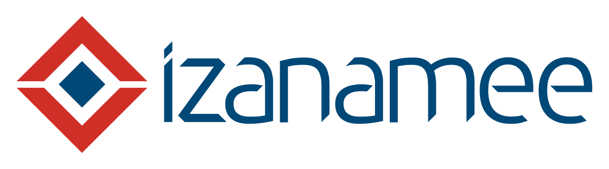

[](https://www.apache.org/licenses/LICENSE-2.0)



Project "Izanamee" (internal working title, external branding tbd) is a set
of virtual machines based on a similar family used internally
at Capital One for layered Java development environments.  We are contributing
these  to the Open Source community to help facilitate a quick-start, level
playing field for hack-a-thons.  

# Background
Capital One needed to provide a consistent way in getting development teams
setup in the layered environments we support and to automate consistent
assemblies from instructions which in some cases spanned multiple pages and
hundreds of line-item steps.  As we all can attest, this methodology is fragile
and brittle at best.

With open source tools such as [Vagrant](https://www.vagrantup.com/),
we have been able to revolutionize the way we could provide and support
development environments across the enterprise; culturally, with this approach,
we have also been able to seed a DevOps mentality earlier.

Izanamee derives its name from the Japanese goddess (_Izanami-no-Mikoto_) of
both creation and death.  We chose it as a nod to the power and flexibility that
`vagrant up` and `vagrant destroy` provides us.  Hats off to Mitchell
Hashimoto and the team at [Hashicorp] (https://www.hashicorp.com) for creating
and supporting this terrific tool, and for hosting the [Atlas](https://atlas.hashicorp.com/izanamee)
public registry of Vagrant images where we are able publish our images.

# Izanamee Family of Virtual Machines

There are currently two virtual machine images built from a base of
__ubunty/trusty64 (14.04)__:

* __Headless (No GUI, 1Gb image)__:
 * Docker
 * Git & Subversion
 * Node/NPM
 * Oracle 7 & 8 JDK
 * Maven & Gradle
 * Tomcat 7 & 8

* __Desktop (GUI, 2Gb image)__:
 * Inventory of Headless +
 * Xubuntu desktop
 * Spring Tool Suite (STS) IDE & relevant plugins
 * Firefox
 * Chrome

For specifics on package versions, please visit the [Release History](https://github.com/izanamee/BigRedHacks2015/releases).

# Host System Requirements

* __Headless__:
 * For Docker and/or Java development, we recommend having at least 8Gb RAM on your host
    device as we allocate 4Gb RAM by default.
 * Less RAM is needed for microservices development in languages like Node, Python or Go.
    Tune this setting in the Vagrantfile.
 * We generally recommend having 10-20Gb free disk.

* __Desktop__:
 * For Docker and/or Java development, we recommend having 16Gb RAM on your host
    device as we allocate 8Gb RAM by default for the guest.  Tune as needed in the Vagrantfile.
 * Less RAM is needed for microservices development in languages like Node, Python or Go.
    Tune this setting in the Vagrantfile.
 * We generally recommend having 15-25Gb free disk.
 * If you are running a supporting GPU, we recommend trying the 3D acceleration settings
    available in VirtualBox (see the Vagrantfile).

Here are the prerequisites which you'll first need to install before you can
begin using the Izanamee family of virtual machines:

* __Manual Install__:
  * [Git](https://git-scm.com/downloads)
  * [VirtualBox](https://www.virtualbox.org/wiki/Downloads)
  * [Vagrant](https://www.vagrantup.com/downloads.html)
* __Mac OSX__ via [Homebrew](http://brew.sh/):
  ```
  $ # if Homebrew is not installed
  $ ruby -e "$(curl -fsSL https://raw.githubusercontent.com/Homebrew/install/master/install)"

  $ # update Homebrew if it was already installed
  $ brew update

  $ # if Cask is not installed
  $ brew install caskroom/cask/brew-cask

  $ # if Git is not installed
  $ brew install git

  $ # installs Vagrant & VirtualBox
  $ brew cask install vagrant virtualbox
  ```
* __Windows__ via [Chocolatey](https://chocolatey.org/):

  __NB:__ If you have previously installed Git, Vagrant & VirtualBox via
  the .msi installer, you may need to uninstall it if you would like to use
  Chocolatey going forward which is recommended for non-managed desktops.

  To install Chocolatey, open an administrative cmd.exe command prompt:
  ```
  C:\> @powershell -NoProfile -ExecutionPolicy Bypass -Command "iex
  ((new-object net.webclient).DownloadString('https://chocolatey.org/install.ps1'))"
  && SET PATH=%PATH%;%ALLUSERSPROFILE%\chocolatey\bin
  ```

  To install dependencies, open an administrative cmd.exd command prompt:
  ```
  C:\> REM installs Git, Vagrant & VirtualBox
  C:\> choco install git vagrant virtualbox
  ```

# How to Install the Izanamee Virtual Machines
The recommended pattern for installing and using an Izanamee virtual machine is
to copy the provided Vagrantfile into the base of your own GitHub repository.

1. Create a GitHub repository
2. Execute the steps below substituting _ghuser_ with your GitHub
   username and _your_repo_ with the name of the repository you created:

   ```
   $ git clone https://github.com/ghuser/your_repo.git
   $ cd your_repo

   $ # if you want to use the headless image, execute the following
   $ curl -O https://raw.githubusercontent.com/izanamee/BigRedHacks2015/master/Vagrantfiles/headless/Vagrantfile

   $ # if you want to use the desktop image, execute the following
   $ curl -O https://raw.githubusercontent.com/izanamee/BigRedHacks2015/master/Vagrantfiles/desktop/Vagrantfile

   $ vagrant up
   $ vagrant ssh
   ```
3. If you have chosen the desktop image, the login credentials for the GUI are
   username: `vagrant` and password: `vagrant`.

The Vagrantfile goes into the base of your project because Vagrant will sync the
current working directory to the `/vagrant` directory inside of the Izanamee
Virtual Machine.  This means you can continue to work on files on your host
machine and they will automatically be available within the Izanamee virtual
machine.  This is especially useful in the case of working on the headless
image as you can continue to use GUI IDEs for development.  Additionally, you
can execute `git` commands and they will work the same on your host machine and
within the Izanamee virtual machine.  

# Getting started using the Izanamee images

<a href="http://www.youtube.com/watch?feature=player_embedded&v=qkroOQR4Kf8
" target="_blank"></a>

# FAQ
FAQs are hosted on our wiki at https://github.com/izanamee/BigRedHacks2015/wiki/FAQ

# Acknowledgements

* __Core Team__: Brent Vukmer, Etienne LaVallee & Keith Gasser
* __Executive Sponsors__: Jeff Elgin, David Geen, Kranthi Dandamudi, Joelle Rowley & Darren McMahon
* __OSS Support__: Al Sell
* __Key Contributors__: Harish Patel, Larry Rosenzweig & Marshall Thompson
